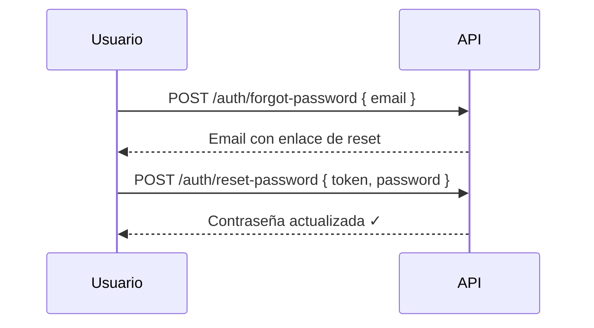

## Flujo completo



---

## Paso 1 — Solicitar reset

```http
POST /auth/forgot-password
```

```json
{ "email": "usuario@empresa.cl" }
```

Se envía un email con un enlace que contiene el token de reset. El enlace expira en un tiempo limitado.

**Response:**
```json
{
  "message": "Se envió un correo con instrucciones para restablecer tu contraseña"
}
```

<Note>
  Por seguridad, la API retorna el mismo mensaje aunque el email no esté registrado — esto evita enumerar usuarios del sistema.
</Note>

---

## Paso 2 — Establecer nueva contraseña

```http
POST /auth/reset-password
```

```json
{
  "token": "<token_del_email>",
  "password": "nuevaContraseña456"
}
```

**Response exitosa:**
```json
{
  "message": "Contraseña actualizada exitosamente"
}
```

---

## Errores

| Código HTTP | Descripción |
|---|---|
| 400 | Token o contraseña no proporcionados |
| 400 | Token inválido o expirado |
| 404 | Email no encontrado |
