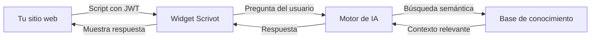

# Bienvenido a Scrivot

**Scrivot** es una plataforma para crear, configurar y desplegar chatbots inteligentes en tu sitio web. Permite definir intenciones, entrenar al asistente con tu propio contenido y embeber el widget en cualquier dominio autorizado.

<CardGroup cols={2}>
  <Card title="Inicio rápido" icon="rocket" href="/quickstart">
    Ten tu chatbot funcionando en menos de 10 minutos
  </Card>
  <Card title="Instalar el widget" icon="code" href="/widget/instalacion">
    Copia el script y agrégalo a tu sitio
  </Card>
  <Card title="Configurar intenciones" icon="brain" href="/chatbot/intenciones">
    Define sobre qué temas responde tu chatbot
  </Card>
  <Card title="Planes y precios" icon="credit-card" href="/planes">
    Compara los planes disponibles
  </Card>
</CardGroup>

---

## Cómo funciona

1. **Embedes el widget** con un `<script>` que incluye tu token JWT.
2. **El usuario escribe** una pregunta en el chat.
3. **El motor de IA** busca en tu base de conocimiento el contexto más relevante.
4. **Se genera una respuesta** acotada a las intenciones que definiste.
5. **La conversación queda registrada** en tu panel para monitoreo.

---

## Componentes de la plataforma

| Componente | Descripción |
|---|---|
| **Panel** (`app.scrivot.cl`) | Configura chatbots, visualiza métricas y gestiona tu espacio de trabajo |
| **Widget** | Interfaz de chat embebida en tu sitio, conecta al usuario con el asistente |
| **Base de conocimiento** | Documentos y respuestas que alimentan al chatbot (RAG) |
| **Base de datos** | Supabase (PostgreSQL) con búsqueda semántica por vectores |
