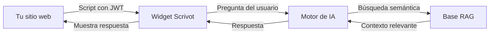

# Bienvenido a Scrivot

**Scrivot** es una plataforma para crear, configurar y desplegar chatbots inteligentes en tu sitio web o aplicación. Permite definir intenciones, entrenar al asistente con tu propio contenido (RAG) y embeber el widget en cualquier dominio autorizado.

<CardGroup cols={2}>
  <Card title="Inicio rápido" icon="rocket" href="/quickstart">
    Instala tu primer chatbot en menos de 10 minutos
  </Card>
  <Card title="Instalar el widget" icon="code" href="/widget/instalacion">
    Copia el script y agrégalo a tu sitio
  </Card>
  <Card title="Configurar intenciones" icon="brain" href="/chatbot/intenciones">
    Define sobre qué temas responde tu chatbot
  </Card>
  <Card title="API Reference" icon="rectangle-terminal" href="/api-reference/introduction">
    Explora todos los endpoints disponibles
  </Card>
</CardGroup>

---

## Cómo funciona

1. **Embedes el widget** con un tag `<script>` que incluye tu token JWT.
2. **El usuario escribe** una pregunta en el chat.
3. **El motor de IA** busca en tu base de conocimiento (RAG) el contexto más relevante.
4. **Se genera una respuesta** acotada a las intenciones que definiste.
5. **La conversación queda registrada** en tu dashboard para monitoreo.

---

## Arquitectura

| Componente | Descripción |
|---|---|
| **Dashboard** (`app.scrivot.cl`) | Configura chatbots, visualiza métricas y gestiona tu workspace |
| **Widget** (`firebot`) | Iframe embebido en tu sitio, comunica al usuario con el agente |
| **Backend API** | NestJS — maneja autenticación, RAG, billing y lógica de negocio |
| **Base de datos** | Supabase (PostgreSQL) con vectores pgvector para búsqueda semántica |
