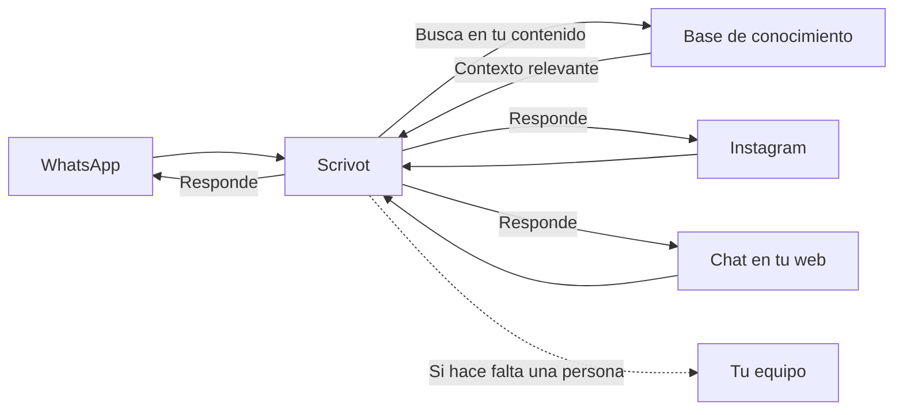

# Bienvenido a Scrivot

**Scrivot** es un asistente que atiende a tus clientes por los canales donde ya te
escriben: **WhatsApp**, **Instagram** y el **chat de tu sitio web**. Un solo asistente,
una sola base de conocimiento y una sola bandeja para los tres.

Responde con lo que tú le cargas, deriva a una persona de tu equipo cuando hace falta, y
—si vendes— puede recomendar productos y llevar al cliente hasta el pago.

<CardGroup cols={2}>
  <Card title="Inicio rápido" icon="rocket" href="/quickstart">
    Ten tu asistente funcionando en menos de 10 minutos
  </Card>
  <Card title="Conectar WhatsApp" icon="whatsapp" href="/canales/whatsapp">
    Atiende desde tu número de WhatsApp Business
  </Card>
  <Card title="Instalar el widget" icon="code" href="/widget/instalacion">
    Copia el script y agrégalo a tu sitio
  </Card>
  <Card title="Traspaso a una persona" icon="user-headset" href="/canales/traspaso-humano">
    Cuándo entra tu equipo y cómo se avisa
  </Card>
</CardGroup>

---

## Los tres canales

| Canal | Qué necesitas | Dónde se configura |
|---|---|---|
| **Chat en tu web** | Pegar un `<script>` en tu sitio | [Widget](/widget/instalacion) |
| **WhatsApp** | Un número de WhatsApp Business | [WhatsApp](/canales/whatsapp) |
| **Instagram** | Una cuenta profesional de Instagram | [Instagram](/canales/instagram) |

Los tres usan el mismo asistente y la misma base de conocimiento: lo que le enseñas una
vez sirve para todos. Puedes activar los que quieras y agregar el resto después.

<Note>
  **Slack no es un canal de entrada.** Es donde atiende tu equipo: recibe ahí las
  conversaciones que necesitan a una persona y responde sin salir de Slack. Ver
  [Slack](/canales/slack).
</Note>

---

## Cómo funciona

```mermaid
flowchart LR
    W[WhatsApp] --> M[Scrivot]
    I[Instagram] --> M
    S[Chat en tu web] --> M
    M -->|Busca en tu contenido| K[Base de conocimiento]
    K -->|Contexto relevante| M
    M -->|Responde| W
    M -->|Responde| I
    M -->|Responde| S
    M -.->|Si hace falta una persona| E[Tu equipo]
```

1. **El cliente escribe** por cualquiera de los canales conectados.
2. **Scrivot busca** en tu base de conocimiento lo que tenga que ver con la pregunta.
3. **Responde** con eso, acotado a lo que le cargaste. Si no lo sabe, lo dice en vez de
   inventarlo.
4. **Deriva a tu equipo** cuando el cliente lo pide o cuando el asistente no puede
   resolverlo, y avisa por navegador o por Slack.
5. **Todo queda en el panel**, con las conversaciones y las métricas de los tres canales
   juntas.

---

## Qué le enseñas al asistente

| Fuente | Para qué sirve |
|---|---|
| [Preguntas y respuestas](/chatbot/intenciones) | Lo que te preguntan siempre, con la respuesta que quieres dar |
| [Contenido propio](/chatbot/rag) | Textos, políticas, condiciones: lo que el asistente debe conocer |
| [Páginas web](/chatbot/desde-url) | Carga una dirección y toma el contenido; reingerirla lo mantiene al día |
| [Productos](/ventas/productos) | Tu catálogo, para que pueda recomendar y cobrar |

---

## Componentes

| Componente | Descripción |
|---|---|
| **Panel** (`app.scrivot.cl`) | Conversaciones, configuración, métricas y equipo |
| **Widget** | El chat que se embebe en tu sitio |
| **Base de conocimiento** | Lo que el asistente sabe, con búsqueda semántica |
| **Canales** | Las conexiones con WhatsApp e Instagram, por las APIs oficiales de Meta |
